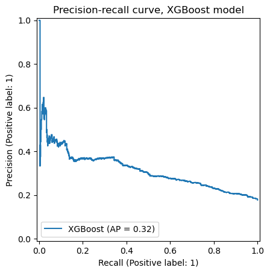

## Waze User Churn Prediction Project

## Project Overview

This project aims to develop a predictive model to forecast user churn on the Waze navigation app. By identifying users at risk of uninstalling the app, Waze can proactively engage these users with special offers to retain them. The model will leverage historical user data to understand patterns and factors contributing to churn, ultimately helping Waze optimize its retention strategy and enhance user experience.

## Business Understanding

The stakeholders for this project include the Waze data team, cross-functional team members, and the Finance and Administration department. The business problem addressed is the prevention of user churn, which is crucial for maintaining user base growth and profitability.

## Data Understanding

The dataset used for this project includes demographic information, usage patterns, and customer satisfaction scores. It covers various user behaviors and interactions with the Waze app. The data is primarily focused on the last month of user activity, with a particular emphasis on the number of drives made within a session and the frequency of app usage.

## Modeling and Evaluation

The project employs both statistical analysis and machine learning techniques. Descriptive statistics and hypothesis testing are used to understand the data and validate assumptions. Multiple logistic regression and tree-based models, including XGBoost and Random Forest, are constructed to predict user churn. The models are evaluated using metrics such as accuracy, precision, recall, and F1 score, with a focus on minimizing false positives and false negatives.

## Conclusion

The predictive model developed in this project aims to identify users most likely to churn and understand the reasons behind their decisions. Although the current models show room for improvement, the insights gained can inform targeted user engagement strategies and feature engineering efforts. Future steps may include refining the model, incorporating additional data sources, and exploring more sophisticated machine learning approaches.

## Ethical Considerations

All data used in this project adheres to strict privacy and fairness guidelines. Personal identifiable information is handled responsibly, and the model's predictions are used ethically to inform business decisions without compromising user privacy.

## References

[1] Waze. (2023). User Churn Analysis Report. Retrieved from https://www.waze.com/waze

[2] Towards Data Science. (2023). Predicting User Churn with Machine Learning. Retrieved from https://towardsdatascience.com/user-churn-prediction-d43c53e6f6df
